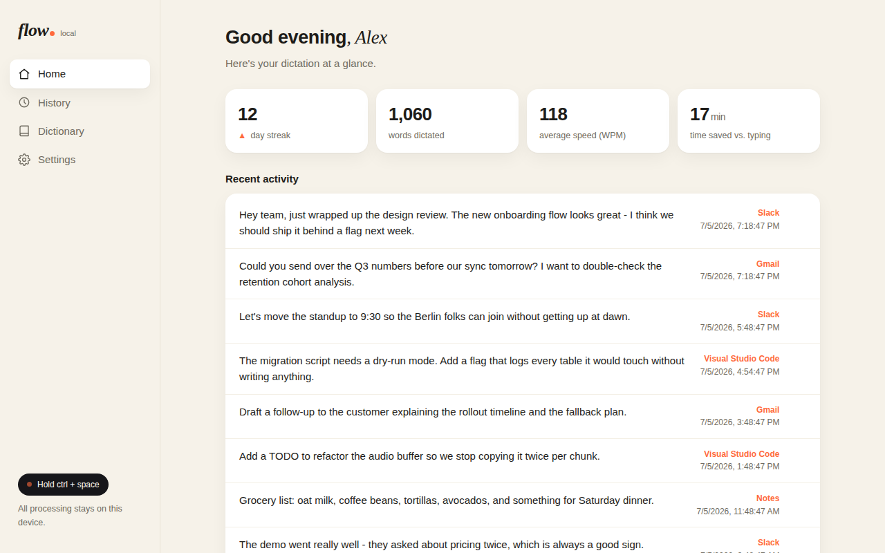

# LocalFlow

**A fully local, open-source voice dictation app — a [Wispr Flow](https://wisprflow.ai) clone powered by [OpenAI Whisper](https://github.com/openai/whisper).**

Hold a hotkey, speak, release: your words appear — cleaned up and formatted — in whatever app has focus. Everything runs on your machine. No cloud, no account, no audio ever leaves your computer.



While you dictate, the floating pill shows a live waveform, then pulses while Whisper formats your words:


## Features

| Wispr Flow | LocalFlow |
|---|---|
| Push-to-talk dictation into any app | ✅ hold a global hotkey, release to insert text at your cursor |
| Hands-free mode | ✅ toggle on; recording auto-stops on silence (built-in VAD) |
| AI formatting | ✅ two layers: a local rule engine (filler-word removal, self-corrections "at five — no wait, six" → "at six", spoken commands, spelled-out numbers → digits, spoken emails → `name@domain.com`, capitalization) **plus a local-LLM cleanup pass that runs in-process** (Apple MLX, Qwen3-4B) — no LM Studio required, and a running LM Studio is never disturbed; point `llm.base_url` at any OpenAI-compatible server to use that instead. Falls back to rules when no model is available |
| Auto Cleanup levels | ✅ Light / Medium / High (Settings → AI formatting), like Wispr Flow's: Light only fixes punctuation and fillers, Medium also fixes grammar slips and unmistakable mishearings ("the riots stop at 54%" → "the writes stop at 54%"), High also smooths false starts. A content-retention guard rejects any LLM output that dropped what you actually said (the model must clean the dictation, never answer or summarize it) |
| Personal dictionary | ✅ names/jargon are fed to Whisper as a bias prompt **and** fuzzy-corrected after transcription; plus text replacements ("omw" → "on my way") |
| Context awareness / app-aware tone | ✅ per-app profiles (terminal, code editor, chat, email, docs) adjust capitalization & punctuation automatically |
| Command mode (edit selected text by voice) | ✅ local commands (uppercase, bullet list, snake case, fix punctuation, shorten, …) + free-form edits ("translate to french", "make it friendlier") via the same local LLM |
| Hallucination & loop prevention | ✅ built-in regex filters strip YouTube sign-offs ("Thanks for watching"), and mathematical segment filters (compression ratio, no_speech_prob) prevent Whisper from degrading or looping on long dictations |
| Whisper-quiet speech | ✅ automatic RMS gain normalization rescues very quiet audio |
| 100+ languages | ✅ multilingual Whisper models with auto-detection or a pinned language |
| Live preview while speaking | ✅ pseudo-streaming partial transcripts via background re-transcription |
| Floating recording pill with live waveform | ✅ frameless always-on-top capsule (tkinter): coral dot + waveform while recording, pulsing dots while formatting |
| Dashboard app (greeting, streak, WPM, time saved, activity) | ✅ the full Flow-style app: Home / History / Dictionary / Settings with live-saving toggles (`localflow ui`) |
| History, streaks, WPM stats | ✅ local SQLite + web dashboard (`http://127.0.0.1:5170`) |
| Privacy | ✅ **stronger**: 100% offline — Wispr Flow sends audio to the cloud, LocalFlow never does |

## Installation

### The easy way (macOS, Apple Silicon)

Grab `LocalFlow-<version>.dmg` from the [releases page](../../releases) (or
build it yourself, below), drag LocalFlow to Applications, and open it —
that's it. The app is fully self-contained: its own Python runtime, Whisper,
and MLX are all inside the bundle. Nothing else to install.

First launch: because the app is unsigned, macOS will block it once — go
to System Settings → Privacy & Security → **Open Anyway** (or run
`xattr -dr com.apple.quarantine /Applications/LocalFlow.app`). Then grant
**Microphone**, **Accessibility** and **Input Monitoring** when asked.
Dictation works immediately and fully offline — the Whisper model ships
inside the app. The built-in AI-formatting model is one click in Settings
→ AI formatting (~2.3 GB, once — skipped automatically if LM Studio
already has the weights on disk).

### The pip way (any platform)

```bash
# from a clone of this repo
pip install -e ".[whispercpp,desktop,llm]"  # whisper.cpp engine + in-process AI formatting
# and/or
pip install -e ".[fasterwhisper,desktop]"   # faster-whisper engine (best accuracy)

# download a model + write default config
localflow setup --model base    # tiny | base | small | medium | large-v3

# check that everything is wired up
localflow doctor
```

Platform notes:

* **Linux (X11)**: install `xdotool` for the most reliable text injection; `portaudio19-dev` may be needed for `sounddevice`.
* **macOS**: grant Accessibility + Microphone permissions to your terminal (System Settings → Privacy & Security). Text is inserted by pasting (pbcopy + a synthesized ⌘V, like Wispr Flow) — simulated typing is unreliable in Messages/Slack/Electron apps.
* **Windows**: works out of the box with `pip install`.

## Run as an app (macOS)

One double-clickable menu-bar app - no terminal, no LM Studio:

```bash
./scripts/build_app.sh --install    # dev build: builds dist/LocalFlow.app, copies to /Applications
open /Applications/LocalFlow.app
```

* Menu bar icon shows status (◎ idle / ◉ recording / ◌ formatting) with
  Open Dashboard, Hands-free Mode and Quit. The dashboard opens as a native
  app window (WKWebView), not a browser tab.
* `localflow autostart on` starts the app at login (`off` to remove).
* The AI-formatting model runs **in-process** (Apple MLX) and is preferred
  even when LM Studio/Ollama is running — dictation never hijacks or swaps
  the model you have loaded there for other work. It reuses weights already
  in LM Studio's model folder, so there's usually nothing to download; else
  `localflow llm download` (or the Settings button) fetches the default
  model (~2.3 GB, one time). Prefer a server anyway? Set `llm.base_url`
  and it wins.
* First launch: grant **Microphone**, **Accessibility** and **Input
  Monitoring** to LocalFlow when macOS asks (it's a new app identity).
* Logs: `~/Library/Logs/LocalFlow.log`. Start at login: System Settings →
  General → Login Items → add LocalFlow.
* The dev build launches the daemon from this repo's `venv` - rebuild after
  moving the repo. (`--standalone` bundles everything instead.)

## Developing on it

The app loads code straight from this repo (default builds), so the loop is:

```bash
# edit code, then:
venv/bin/python -m pytest tests/ -q     # 200+ tests, fully hermetic
pkill -x LocalFlow; open /Applications/LocalFlow.app   # restart to apply
# (the daemon process IS "LocalFlow" - "pkill -f localflow.cli" no longer matches)
tail -f ~/Library/Logs/LocalFlow.log    # watch it live
```

Or run `venv/bin/localflow run -v` in a terminal for interactive logs with
per-dictation timing. Only `scripts/build_app.sh` changes (stub/plist/icon)
need a rebuild - which re-signs the bundle, so macOS asks for Accessibility
again once.

## Giving it to a friend

```bash
./scripts/build_app.sh --standalone --dmg   # everything inside the bundle:
                                            # its own Python runtime + deps
```

Send them `dist/LocalFlow-<version>.dmg`. On their Mac (Apple Silicon):

1. Open the DMG, drag LocalFlow to Applications. macOS blocks unsigned
   apps once: System Settings → Privacy & Security → **Open Anyway** - or
   `xattr -dr com.apple.quarantine /Applications/LocalFlow.app`.
2. Grant Microphone / Accessibility / Input Monitoring when prompted.
3. Done - dictation works immediately, fully offline (the Whisper model is
   inside the app). The built-in AI-formatting model is one click in
   Settings → AI formatting.

Nothing to install first - no Homebrew, no Python. (Tagged releases build
the same DMG automatically via GitHub Actions; see `.github/workflows/release.yml`.)

## Usage (terminal)

```bash
localflow run
```

* **Hold `Ctrl+Space`** — speak — release: text is typed into the focused app.
* **`Ctrl+Shift+Space`** — toggle hands-free dictation (stops on silence, repeats).
* **`Ctrl+Alt+Space`** — command mode: copy some text, press the hotkey, speak an instruction ("make this a bullet list"), press again.
* Dashboard with history, stats, dictionary editing: printed at startup (default `http://127.0.0.1:5170`).

All hotkeys are configurable:

```bash
localflow config set hotkeys.push_to_talk "<f9>"
```

### Other commands

```bash
localflow ui                             # open the dashboard app on its own
localflow transcribe memo.wav            # transcribe an audio file (add --json, --raw)
localflow listen                         # one hands-free dictation, prints the text
localflow dictionary add Wispr           # teach it names/jargon
localflow dictionary add brb "be right back"   # text replacement
localflow history --search "meeting"     # search past dictations
localflow stats                          # words, WPM, streak
localflow config show                    # full config as JSON
```

Config lives at `~/.config/localflow/config.json` (see `localflow/config.py` for every option — engine, hotkeys, audio/VAD, formatting toggles, per-app profiles, output method).

## Architecture

```
mic (sounddevice) ──► Recorder ──► VAD / RMS normalize ──► STT engine
                                                            (faster-whisper | whisper.cpp)
                                                                    │  ◄─ dictionary bias prompt
                                                                    ▼
   focused app ◄── Injector (⌘V paste / xdotool / pynput) ◄── Formatter ◄── dictionary correction
       ▲                                                        (rule engine + local LLM cleanup:
       │                                                         in-process MLX, or LM Studio/
       │                                                         Ollama via base_url; app tone)
  HotkeyListener (pynput)                                               │
  Tray icon (pystray)          History (SQLite) ◄── FlowController ◄────┘
  Dashboard (localhost)  ◄────────┘
```

Every OS-dependent piece (microphone, hotkeys, window detection, typing) sits behind a small interface with a headless implementation, so the entire pipeline is unit-testable — and the STT layer is pluggable, so new engines are ~50 lines.

## Testing

```bash
pip install -e ".[dev]"
pytest                # 230+ tests
```

The suite includes true end-to-end tests: speech is synthesized with `espeak-ng`, transcribed by a **real Whisper model** (whisper.cpp `ggml-tiny`), formatted, and injected — no mocks. Those tests auto-skip when `espeak-ng` or the model isn't available; everything else runs anywhere. Drop a model at `tests/models/ggml-tiny.bin` (or `~/.local/share/localflow/models/`) to enable them.

## Limitations vs. Wispr Flow

* The LLM cleanup pass adds latency proportional to your model's speed. A small instruct model is all this task needs — **Qwen3-4B-Instruct-2507 (MLX 4-bit) does a full cleanup in ~0.4s on Apple Silicon** and was the best of the models we benchmarked (gpt-oss-20b: same quality, ~1.4s; Gemma-4-E4B: disqualified — it force-thinks ~90 tokens before every answer and the thinking can't be disabled over the API; big MoE models: slow and RAM-hungry). Avoid "thinking" models here generally. Turn the pass off in Settings → AI formatting for instant rule-based-only insertion.
* "Streaming" preview re-transcribes the buffer periodically; Whisper isn't natively streaming.
* Wayland restricts global hotkeys and synthetic typing; X11/macOS/Windows are the happy paths.

## License

MIT
